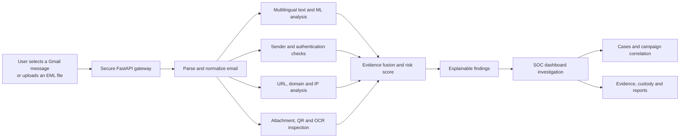

# NETRA-Mail Project Guide

## 1. What is NETRA-Mail?

NETRA-Mail is an explainable, multilingual email-threat analysis and digital-forensics platform. It helps a user or security analyst move from a suspicious email to an investigation-ready report.

Instead of displaying only a label such as **Safe** or **Phishing**, NETRA-Mail answers the questions that matter during an investigation:

- What made the email suspicious?
- Which sender, language, URL, domain, header or attachment signals contributed to the result?
- What infrastructure appears in the observed email route?
- Have similar indicators appeared in other analyzed messages?
- Can the investigation evidence be preserved and reviewed later?

### One-line explanation

> NETRA-Mail detects suspicious email behavior, explains the evidence, supports investigation, connects related threats, and preserves a traceable forensic record.

---

## 2. The problem it addresses

Email attacks rarely depend on one obvious indicator. A phishing message may combine:

- a trustworthy-looking display name;
- a different Reply-To address;
- urgent payment or credential language;
- a misleading or shortened URL;
- a QR code that hides a destination;
- a dangerous or deceptive attachment;
- mixed languages or Romanized regional-language phrases;
- incomplete or failed authentication evidence.

Conventional spam filters often hide their reasoning or stop at a classification. Analysts then have to inspect headers, links, infrastructure and evidence using separate tools. NETRA-Mail brings these stages into one connected workflow.

---

## 3. How it works

### Typical Gmail workflow

1. The user opens an email in Gmail.
2. The user opens the NETRA-Mail Shield extension.
3. The user selects **Analyze current email**.
4. The extension sends the visible message data to the configured NETRA backend.
5. The backend analyzes the available sender, subject, body, URL and language signals.
6. The extension displays the risk score and classification beside the email.
7. The **View forensic report** link opens that exact email investigation in the SOC dashboard.

Analysis is user-initiated. Merely opening an email does not automatically send it to NETRA-Mail.

### Original EML workflow

An analyst can upload an original `.eml` message to provide richer MIME, header, authentication and attachment evidence. Original bytes enable checks that cannot be performed reliably from content reconstructed from a Gmail page.

---

## 4. Main capabilities

### 4.1 Explainable phishing-risk analysis

NETRA-Mail combines multiple signals into a normalized risk score and classification. Findings include evidence, confidence and limitations so that analysts can understand why a signal was raised.

It can identify patterns associated with:

- credential-harvesting messages;
- business-email compromise and payment-change requests;
- urgent or threatening social-engineering language;
- sender, Reply-To and Return-Path inconsistencies;
- suspicious links, redirects and domain characteristics;
- risky attachment types and archive contents;
- Unicode direction controls and mixed-script domains;
- QR-code destinations and text found in supported images.

The result is decision support for a human reviewer. It is not a guarantee that an email is safe or malicious.

### 4.2 Multilingual phishing intelligence

Multilingual analysis is one of NETRA-Mail's core features. The current language profiles cover:

| Language profile | Supported input style |
|---|---|
| English | Latin script |
| Hindi | Devanagari and Romanized cues |
| Tamil | Tamil script and Romanized cues |
| Telugu | Telugu script and Romanized cues |
| Kannada | Kannada script and Romanized cues |
| Malayalam | Malayalam script and Romanized cues |

The module can report:

- detected language and script;
- the detection method;
- mixed-language or mixed-script context;
- phishing-related urgency, credential, OTP, financial-fraud and social-engineering cues;
- a contextual multilingual security score;
- confidence and limitations.

This feature detects security cues; it is not a translation service. Language alone never makes a message malicious. Per-language precision and recall still need evaluation on a sufficiently large, independently labelled corpus.

### 4.3 Sender and email-authentication analysis

NETRA-Mail examines available identity and delivery evidence, including:

- From, Reply-To and Return-Path relationships;
- display-name and address inconsistencies;
- Received-header relay chains;
- DKIM signature evidence and local verification when original signed bytes are available;
- trusted receiver SPF evidence when SMTP receipt context is available;
- DMARC identifier alignment;
- ARC chain evidence when the original chain is available.

Missing evidence is shown as **unavailable** rather than being treated as a pass. Authentication success also does not prove that a message is harmless.

### 4.4 URL and domain intelligence

For links and domains found in the message, NETRA-Mail can inspect:

- URL structure and encoding;
- suspicious schemes, ports and credentials;
- shortened links and redirect evidence when controlled expansion is enabled;
- IP-literal hosts;
- mixed-script and lookalike domain patterns;
- domain registration and DNS context when available;
- optional Google Safe Browsing and URLhaus reputation results;
- relationships between repeated domains, URLs and analyzed emails.

Static inspection remains available without external reputation providers. Optional reputation checks disclose the analyzed URL to the configured provider and must be deliberately enabled.

### 4.5 Relay-path and infrastructure context

NETRA-Mail parses public hops observed in Received headers and identifies the oldest observed public-hop candidate. It can enrich public IP addresses with:

- approximate network location;
- ASN and network-provider information;
- proxy, VPN or Tor indicators when a configured provider supplies them;
- related messages and infrastructure relationships.

This is infrastructure evidence. An IP address or map position does not identify the human sender and must not be presented as physical attribution.

### 4.6 Attachment, archive, QR and OCR inspection

The attachment-analysis pipeline supports bounded static inspection of:

- filenames, extensions, MIME types, hashes and sizes;
- suspicious or executable attachment types;
- archive members and dangerous nested content within configured limits;
- image dimensions and basic image validation;
- QR-code payload extraction;
- OCR text extraction from supported images;
- URLs discovered inside QR or OCR output.

Content inspection runs through a constrained Docker worker when configured. The worker has time, memory, CPU, process, file and response limits. NETRA-Mail does not execute attachment payloads and is not a full malware-detonation sandbox.

### 4.7 SOC investigation dashboard

The Streamlit dashboard gives analysts a structured investigation view containing:

- recent analyzed emails;
- classifications, scores and detailed findings;
- sender and authentication evidence;
- relay trace and infrastructure context;
- related domains, URLs, IPs and messages;
- investigation graphs;
- cases, notes, tags and timelines;
- campaigns and campaign relationships;
- evidence records, versions and custody events;
- report creation and download.

The Chrome extension links directly to the dashboard record for the email being viewed, avoiding a manual search.

### 4.8 Case and campaign correlation

Analysts can group emails into cases and correlate messages using shared indicators such as:

- domains;
- URLs;
- IP addresses;
- sender-related fields;
- repeated message and campaign signals.

Correlation helps find recurring infrastructure or coordinated behavior. It does not by itself prove that two messages came from the same person or organization.

### 4.9 Forensic evidence and reporting

NETRA-Mail supports an evidence lifecycle beyond the initial alert:

- SHA-256 hashes for evidence integrity;
- a tamper-evident ledger chain;
- versioned evidence objects;
- custody events and investigation timelines;
- case-linked evidence;
- integrity verification;
- JSON, HTML and PDF forensic reports;
- optional AES-256-GCM encryption for stored evidence.

Hashes help show whether stored bytes changed. They do not prove that the original source was truthful or establish legal admissibility on their own.

### 4.10 Security and privacy controls

The project includes controls for local and hosted operation:

- user-initiated Gmail analysis;
- HTTPS-only remote backend addresses;
- a fixed extension identity across computers;
- explicit browser-origin allowlists;
- API identities stored as SHA-256 token digests;
- admin, analyst, auditor and submitter roles;
- local-profile extension credentials that persist across browser restarts;
- request-size and rate limits;
- PII masking for applicable analysis paths;
- optional encrypted evidence storage;
- controlled provider disclosure;
- fail-closed hosted deployment checks.

The deployed API and dashboard addresses are configured automatically and Email Protection starts enabled. The extension access key is entered once per Chrome profile and remains available across browser restarts without being synchronized to other computers.

---

## 5. Technology stack

| Area | Technology | Purpose |
|---|---|---|
| Browser integration | JavaScript, Chrome Manifest V3 | User-initiated Gmail analysis and risk badge |
| Backend API | Python, FastAPI, Uvicorn | Validation, ingestion, orchestration and APIs |
| Detection | Rules, NLP-style cues, scikit-learn | Explainable email and URL risk analysis |
| Multilingual analysis | Unicode/script analysis and contextual dictionaries | Native-script, Romanized and mixed-language cues |
| Email authentication | dkimpy, DNS utilities and local alignment logic | DKIM, ARC, SPF context and DMARC evidence |
| Images | OpenCV and RapidOCR | QR extraction and OCR-assisted inspection |
| Isolated inspection | Docker | Constrained attachment and URL worker |
| Forensic ledger | SQLite and SHA-256 | Persisted investigations and integrity chain |
| Protected storage | `cryptography` / AES-GCM | Authenticated evidence encryption |
| Dashboard | Streamlit, Folium | SOC workflow and infrastructure presentation |
| Reporting | ReportLab and HTML/JSON generation | Downloadable forensic reports |
| Deployment | Render and HTTPS | Hosted API and dashboard services |

---

## 6. What makes NETRA-Mail distinctive?

### Multilingual context

Many security tools focus heavily on English. NETRA-Mail treats Indian-language scripts, Romanized expressions and mixed-language messages as first-class analysis context.

### Explanation before automation

Every important finding is designed to show its evidence and limitation. The platform avoids presenting missing provider data or missing original headers as proof of safety.

### Alert-to-investigation continuity

The workflow begins inside Gmail and continues in the matching SOC dashboard record. Detection, infrastructure context, correlation, evidence preservation and reporting remain connected.

### Responsible attribution boundaries

The system distinguishes an observed public relay or network location from the identity or physical location of an attacker.

### Forensics built into the workflow

Evidence hashes, versions, custody and reports are part of the platform rather than an unrelated manual process performed after detection.

---

## 7. Capability status

| Capability | Current status |
|---|---|
| Gmail manual analysis | Implemented |
| Direct forensic-report link | Implemented |
| Original EML upload | Implemented |
| Explainable risk findings | Implemented |
| Six language profiles | Implemented; independent per-language evaluation remains |
| URL and domain static analysis | Implemented |
| Reputation providers | Implemented but optional and credential-dependent |
| Header and authentication analysis | Implemented; completeness depends on original bytes and trusted context |
| Relay and IP enrichment | Implemented; provider-dependent enrichment may be unavailable |
| Attachment metadata and archive inspection | Implemented |
| QR and OCR inspection | Implemented; language and accuracy acceptance remains |
| Isolated Docker inspection | Implemented; requires the worker image and Docker runtime |
| Cases, campaigns and relationships | Implemented |
| Evidence ledger and custody | Implemented |
| PDF, HTML and JSON reports | Implemented |
| Hosted API and dashboard | Supported through Render configuration |
| Organizational SSO and full tenant isolation | Future production work |
| Dynamic malware detonation | Outside the current prototype |
| Production detection-accuracy claim | Not established |

---

## 8. A simple three-minute demonstration

### Step 1 — Detect

Open a suspicious Gmail message and select **Analyze current email**. Show the classification, score and short explanation beside the subject.

### Step 2 — Explain

Point out the evidence: suspicious language, sender mismatch, deceptive URL, authentication result, QR/OCR signal or attachment finding. Show how unavailable evidence is labelled honestly.

### Step 3 — Investigate

Open **View forensic report**. Show the detailed findings, relay trace, domain/IP context and investigation graph.

### Step 4 — Correlate

Show related indicators, link the email to a case, and explain how repeated URLs, domains or infrastructure may reveal a larger campaign.

### Step 5 — Preserve and report

Show the evidence hash, timeline and custody record. Generate a PDF or HTML report.

### Closing line

> NETRA-Mail does not merely label an email. It gives the analyst the evidence, context and custody record needed to act responsibly.

---

## 9. Important limitations

NETRA-Mail is an investigation-support prototype. Friends, judges and potential users should understand these boundaries:

- A low score does not guarantee that a message is safe.
- The current ML data and synthetic regression cases do not establish production accuracy.
- Multilingual accuracy must be evaluated separately for every supported language and input style.
- Gmail page extraction cannot provide every original header or attachment byte.
- DKIM verification requires the original signed message bytes.
- SPF requires trusted SMTP receipt context.
- Authentication success does not prove sender intent or message safety.
- GeoIP and ASN data describe network infrastructure, not a person's identity.
- Campaign correlation requires analyst confirmation.
- QR/OCR results depend on image quality and decoder support.
- Reputation services and enrichment providers may be unavailable.
- Durable hosted use requires persistent storage, backups, monitoring and recovery exercises.
- A real institutional deployment should add organizational login/SSO, retention policy, operational monitoring and security review.

---

## 10. Frequently asked questions

### Is NETRA-Mail an email provider?

No. It analyzes suspicious messages and supports investigation. Gmail is currently integrated through the Chrome extension, while original messages can also be submitted as EML files.

### Does it scan every email automatically?

No. The extension analyzes an open Gmail message only after the user selects **Analyze current email**.

### Is it only an AI classifier?

No. It combines rules, multilingual cues, ML scores, sender/header evidence, URLs, domains, observed infrastructure, attachments, QR/OCR results, cases and forensic evidence.

### Can it identify the attacker?

No. It can show observed network infrastructure and relationships that support an investigation, but it does not establish human attribution.

### Does it support regional languages?

Yes. It currently has profiles for Hindi, Tamil, Telugu, Kannada and Malayalam alongside English, including selected Romanized cues. This is contextual phishing analysis rather than translation.

### Can it inspect attachments?

Yes, through static and bounded inspection. It does not execute suspicious programs or replace a dedicated malware sandbox.

### Can it create a report?

Yes. Cases and investigations can produce JSON, HTML and PDF reports with supporting findings and evidence records.

### Why does another computer need the access key once?

The key is deliberately stored only in the local Chrome profile and is never committed to Git or synchronized. Each computer needs the authorized extension key once; subsequent browser sessions reconnect automatically.

---

## 11. Short description to share with friends

> We built NETRA-Mail, a multilingual phishing-detection and email-forensics platform. A user can analyze the email currently open in Gmail and immediately see an explainable risk score. The platform examines sender inconsistencies, social-engineering language, regional-language cues, links, domains, email-authentication evidence, relay headers, attachments, QR codes and OCR text. A direct link opens the same email in a SOC dashboard, where an analyst can inspect findings, trace observed infrastructure, correlate related threats, create cases, preserve evidence and generate a forensic report. The system is designed to show uncertainty and unavailable evidence instead of pretending every result is conclusive.

---

## 12. Project resources

- Source repository: <https://github.com/nitheenkumar25bcy37-alt/NETRA-MAIL>
- Local and release setup: [INSPECTION_AND_RELEASE.md](INSPECTION_AND_RELEASE.md)
- Render deployment: [RENDER_DEPLOYMENT.md](RENDER_DEPLOYMENT.md)
- SIH demonstration guide: [SIH_26106_FINALIST_DEMO.md](SIH_26106_FINALIST_DEMO.md)
- API documentation after startup: `/docs` on the backend service
- DKIM standard: <https://www.rfc-editor.org/info/rfc6376/>
- SPF standard: <https://www.rfc-editor.org/info/rfc7208/>
- DMARC standard: <https://www.rfc-editor.org/info/rfc7489/>
- Digital-forensics guidance: <https://csrc.nist.gov/pubs/sp/800/86/final>
